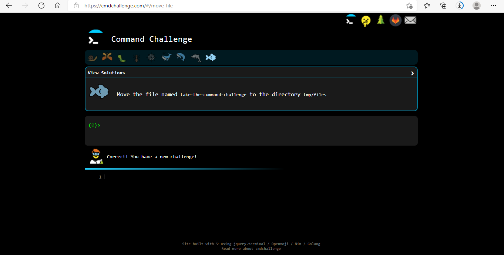

# CMD CHALLENGE

## Background Context

CMD CHALLENGE is an engaging game designed to test and improve your Bash skills. It revolves around command line tasks, and the complexity of questions increases as you progress. It serves as excellent training to enhance your command line proficiency.

**Note: This project is optional and not mandatory. Participating in any part of this project will contribute over 100% to your average grade. Your overall score won't be affected if you choose not to participate. However, if your current average exceeds your score on this project, your average might decrease. Have fun!**

## Requirements

### General

- A `README.md` file at the root of the project folder is mandatory.
- The project will be manually reviewed.
- As each task is completed, the name of that task will turn green.
- Create a screenshot for each completed level and push it to GitHub in either PNG or JPEG format.

### Specific

In addition to completing the project tasks and submitting the required screenshots to GitHub, you are also required to demonstrate the use of the SFTP (Secure File Transfer Protocol) command-line tool to move your local screenshots to the sandbox environment.

**References:**
- [SFTP Guide](link-to-sftp-guide)
- [SFTP File Transfer Tutorial](link-to-sftp-tutorial)

## SFTP File Transfer Instructions

1. Take screenshots of the completed levels as mentioned in the general requirements.
2. Open a terminal or command prompt on your local machine.
3. Use the SFTP command-line tool to establish a connection to the sandbox environment. You will need the hostname, username, and password provided for the sandbox environment.
4. Once connected, navigate to the directory where you want to upload the screenshots.
5. Use the SFTP `put` command to upload the screenshots from your local machine to the sandbox environment.
6. Confirm that the screenshots have been successfully transferred by checking the sandbox directory.
7. Once the screenshots are transferred, proceed to push the screenshots to GitHub as mentioned in the initial requirements.

Make sure to include the steps you followed to use the SFTP command-line tool in your project’s README.md file. This will help the reviewers understand how you performed the file transfer using SFTP.

**NOTE:** The screenshots of completed levels should be inside the directory `/root/alx-system_engineering-devops/command_line_for_the_win/`

## Tasks

### 0. First Nine Tasks (Advanced)

Complete the first 9 tasks.

Repo:
- GitHub repository: [alx-system_engineering-devops](alx-system_engineering-devops)
- Directory: `command_line_for_the_win`
- File: [0-first_9_tasks.png](0-first_9_tasks.png)

### 1. Reach חי Completed Tasks (Advanced)

Complete the next 9 tasks, reaching a total of 18.

Repo:
- GitHub repository: [alx-system_engineering-devops](alx-system_engineering-devops)
- Directory: `command_line_for_the_win`
- File: [1-next_9_tasks.png](1-next_9_tasks.png)

### 2. Reach the Perfect Cube, 27 (Advanced)

Complete the next 9 tasks, reaching a total of 27.

Repo:
- GitHub repository: [alx-system_engineering-devops](alx-system_engineering-devops)
- Directory: `command_line_for_the_win`
- File: [2-next_9_tasks.png](2-next_9_tasks.png)
